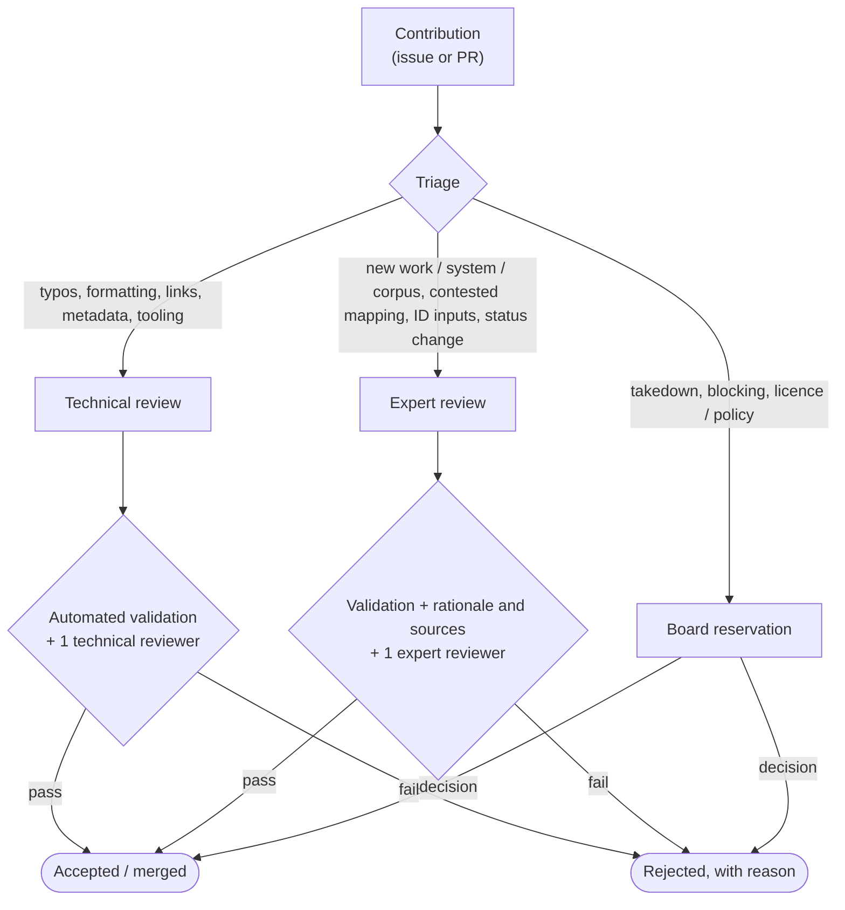

# Contributing to TextRefs

Thanks for helping build TextRefs. This guide covers how to get the site running locally, how the review process works, and the conventions PRs need to follow.

## Ground rules

- Be kind. Participation is governed by the [Code of Conduct](./CODE_OF_CONDUCT.md).
- Security issues do **not** go in public issues. See the [Security Policy](./SECURITY.md).
- Contributions are accepted under the project's licences:
  - code under **AGPL-3.0-or-later**;
  - documentation and standard text under **CC BY-SA 4.0**;
  - registry data under **CC0 1.0**.

  Submitting a contribution means you agree that your work can be released under the licence applicable to that file.

## What you can contribute

- Issues — bug reports, mapping inconsistencies, broken external links, documentation gaps.
- Pull requests — code, content, or data changes.
- Mapping proposals — additions, corrections, or status changes to external-identifier mappings.
- Domain feedback — comments on works, citation systems, normalization rules.

For registry-data contributions, first read [How it works](https://textrefs.org/get-started/how-it-works/) and [Mappings and resolver targets](https://textrefs.org/get-started/mappings-and-resolver-targets/). They explain how to distinguish canonical reference identity from external identifiers and reading URLs.

A contribution does not create a claim to acceptance, prioritization, publication, compensation, or membership. See the [governance regulation](https://textrefs.org/association/governance/) for the full review tracks.

## Review tracks

Changes are routed to one of two tracks:

- **Technical review** — typos, formatting, broken links, minor metadata, `last_checked` updates, uncontested aliases, build / tooling fixes. Needs automated validation and one technical reviewer.
- **Expert review** — new works, new citation systems, new corpora, contested mappings, changes to deterministic ID inputs, status changes (`active` / `deprecated` / `withdrawn` / `blocked`). Needs technical validation, a documented rationale with sources, and at least one expert reviewer.

The Board reserves decisions on legal or policy-sensitive matters (takedowns, blocking, licence policy).



## Local development

Prerequisites: Node 20+ and npm.

```sh
git clone https://github.com/textrefs/textrefs.org.git
cd textrefs.org
npm install              # also wires git hooks via husky
npm run dev              # http://localhost:4321
```

Before pushing, run the gate locally:

```sh
npm run verify           # Prettier check + astro check + build
```

`npm run format` rewrites files in place if Prettier finds drift.

## Commit messages

This repo enforces [Conventional Commits](https://www.conventionalcommits.org/) via a `commit-msg` hook (commitlint). Non-conforming messages are rejected.

Use one of:

- `feat:`, `feat(scope):` — user-visible feature
- `fix:` — bug fix
- `docs:` — documentation only
- `refactor:` — code restructure without behaviour change
- `chore:`, `build:`, `ci:` — tooling, dependencies, CI
- `style:` — formatting
- `test:` — tests
- `perf:` — performance

Easiest way to get a valid message:

```sh
npm run commit           # opens the cz-git guided prompt
```

The changelog is generated from this history via `npm run changelog` (git-cliff).

## Submitting a pull request

1. Branch from `main`.
2. Keep PRs focused — one logical change per PR.
3. Link related issues in the PR description.
4. Make sure `npm run verify` passes.
5. Open the PR against `main`. GitHub requests `@textrefs/maintainers` by default via `.github/CODEOWNERS`; maintainers may add technical or expert reviewers based on the track.

## Project layout

See [`AGENTS.md`](./AGENTS.md) for the high-level layout: where the brand assets live, how the bilingual association section is organised, and which docs are mirrored at the repo root vs under `src/content/docs/community/`.

## Questions

- General questions: open a GitHub Discussion or a low-priority issue.
- Code-of-Conduct concerns: <community@textrefs.org>.
- Security: see the [Security Policy](./SECURITY.md).
