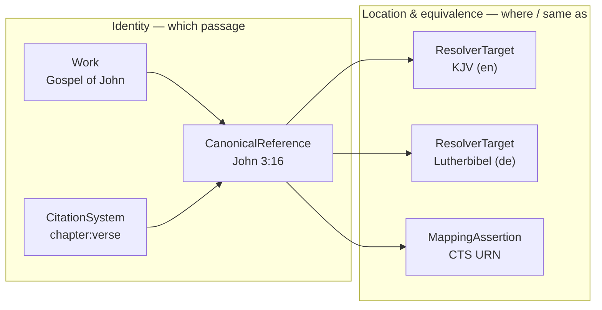

:::caution[Working draft]
TextRefs `v0.1.0-draft` is an **unstable working draft**. The data model and this specification may change without notice and without a version bump while the core is being settled. Do not rely on it for production use yet.
:::

TextRefs defines a minimal registry standard for stable, machine-addressable references to texts. Its centre is the separation of **identity** from **location**: a reference such as `John 3:16` is one abstract, language-independent identity, while the translations, editions, and providers that carry it are recorded as locations. The model has five object types — `Work`, `CitationSystem`, and `CanonicalReference` for identity, plus `ResolverTarget` and `MappingAssertion` for location and equivalence. TextRefs never hosts full text, apparatus, commentary, or copyrighted edition content.

One identity fans out to many locations and equivalences — adding a translation adds a `ResolverTarget`, never a new reference:

## Read the standard

- **[Specification](/standard/specification/)** — the normative document: object model, conformance, validation, and the conformance boundary.
- **[Identifier syntax](/standard/identifier-syntax/)** — deterministic UUID v5 generation, namespace, and serialization rules.
- **[Citation-system profiles](/standard/system-profiles/)** — how citation systems constrain locators, with the seed Bekker and Stephanus profiles.
- **[JSON-LD context](/standard/json-ld/)** — the context mapping TextRefs records onto SKOS, Dublin Core, and schema.org.
- **[Versioning & data packaging](/standard/versioning/)** — how the spec and the monthly registry exports are versioned and packaged.

## Cite this spec

These pages are the working authority for the standard while `v0.1.0-draft` is being settled. The `v1` JSON-LD context is served at `https://textrefs.org/contexts/v1.jsonld`. A frozen, citable release will be tagged once the core stabilises.
