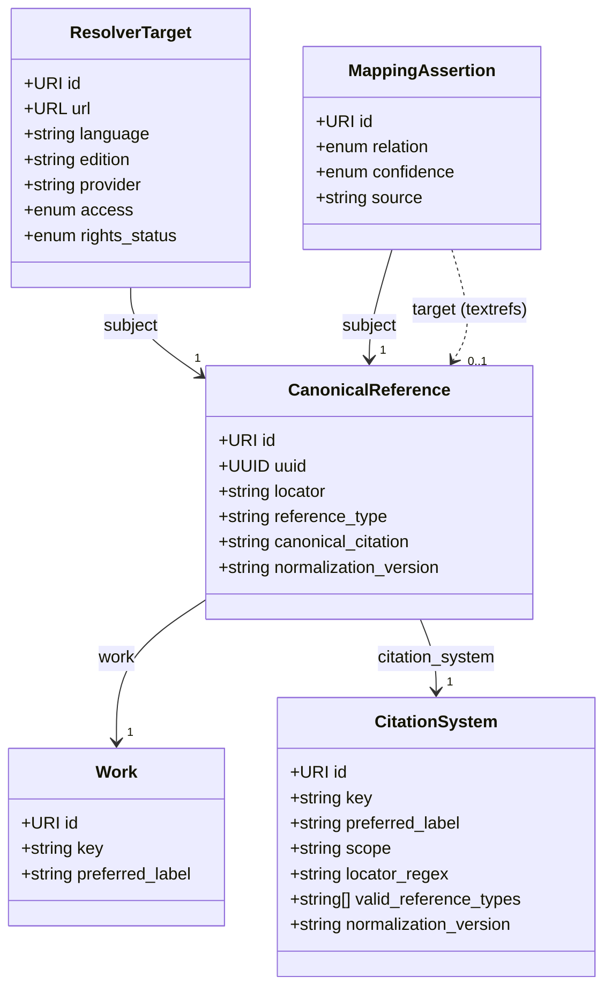

:::caution[Working draft]
TextRefs `v0.1.0-draft` is an **unstable working draft**. The data model and this specification may change without notice and without a version bump while the core is being settled. Do not rely on it for production use yet.
:::

**Version:** 0.1.0-draft\
**Status:** Draft\
**Scope:** a minimal standard for machine-addressable canonical text references.

## 1. Purpose

TextRefs defines a minimal registry standard for stable, machine-addressable references to texts.

A conforming TextRefs registry MUST provide persistent identifiers for canonical references and MUST describe the citation systems by which those references are formed. It MAY record dereferenceable locations for those references and curated mappings to external identifiers or other references.

The standard is deliberately small. Its centre is a single idea: **a reference is an abstract identity, separate from any location, edition, or translation where the referenced text can be read.**

## 2. Conformance

A dataset conforms to the TextRefs Standard if it satisfies all of the following:

1. It represents registry data using the object types defined in this standard.
2. Every registry object includes the required fields for its object type.
3. Every `CanonicalReference` points to one known `Work` and one known `CitationSystem`.
4. Every `CanonicalReference.locator` validates against the referenced `CitationSystem`.
5. Every `CitationSystem` declares valid and invalid examples for automated tests.
6. Every dereferenceable location is represented through a `ResolverTarget`, and every external identifier or cross-reference equivalence through a `MappingAssertion`.
7. Every registry object includes administrative metadata.

A conforming registry record MUST NOT include full text, apparatus, commentary, translation text, or copyrighted edition content.

## 3. Normative language

The key words `MUST`, `MUST NOT`, `REQUIRED`, `SHALL`, `SHALL NOT`, `SHOULD`, `SHOULD NOT`, `RECOMMENDED`, `NOT RECOMMENDED`, `MAY`, and `OPTIONAL` in this document are to be interpreted as described in [BCP 14](https://www.rfc-editor.org/info/bcp14), [RFC 2119](https://www.rfc-editor.org/rfc/rfc2119), and [RFC 8174](https://www.rfc-editor.org/rfc/rfc8174) when, and only when, they appear in all capitals.

## 4. Identity versus location

TextRefs separates **identity** from **location**.

- **Identity** is abstract and language-independent. `Work`, `CitationSystem`, and `CanonicalReference` answer the question "_which_ passage": for example _the Gospel of John, chapter-and-verse, 3:16_. There is exactly one such identity, regardless of how many editions, translations, or websites carry it.
- **Location and equivalence** answer "_where_ can I read it" and "_what else_ is this the same as". `ResolverTarget` records a place where a reference can be read (a specific translation, edition, or provider); `MappingAssertion` records that a reference is equivalent to an external identifier or to another reference.

A reference such as `John 3:16` is the **same identity** whether read in Greek, the King James Version, or the Lutherbibel. The translation is a property of the _location_, never of the identity. This is what lets the model scale to works with hundreds of translations (see [§13](#13-worked-example-a-multi-translation-work)).

TextRefs never stores the text itself. Full text, critical apparatus, commentary, and copyrighted edition content are out of scope and MUST NOT appear in registry records.

## 5. Core object types

A conforming registry MUST support these object types. Each object MUST carry a `type` field matching one of them.

| Type                 | Layer       | Purpose                                                       |
| -------------------- | ----------- | ------------------------------------------------------------- |
| `Work`               | identity    | An abstract textual work.                                     |
| `CitationSystem`     | identity    | A notation that fragments works into locators.                |
| `CanonicalReference` | identity    | One abstract reference point in a work.                       |
| `ResolverTarget`     | location    | A place where a reference can be read.                        |
| `MappingAssertion`   | equivalence | A curated equivalence to an external ID or another reference. |

The five types depend on one another as follows. Every object additionally carries the shared administrative metadata of [§12](#12-administrative-metadata) (omitted from the diagram for clarity).



A `MappingAssertion.target` may instead be an external identifier (CTS URN, Wikidata ID, DOI, ARK, …); there is no separate object type for external identifiers, so that case is expressed inline in the assertion rather than as a node above (see [§10](#10-mappingassertion)).

## 6. Work

A `Work` represents an abstract textual work, independent of editions, translations, manuscripts, files, websites, or resolver targets.

```json
{
  "id": "https://textrefs.org/id/work/bible/john",
  "key": "bible:john",
  "type": "Work",
  "preferred_label": "Gospel of John",
  "status": "active",
  "created": "2026-01-01",
  "modified": "2026-01-01",
  "schema_version": "v0.1.0-draft",
  "record_version": 1
}
```

Required: `id`, `key`, `type` (`Work`), `preferred_label`, `status`, plus administrative metadata ([§12](#12-administrative-metadata)). The `id` MUST be a persistent TextRefs HTTP URI; the `key` MUST be stable and suitable for deterministic identity generation.

## 7. CitationSystem

A `CitationSystem` defines the notation and validation rules used to identify locations within one or more works. It is independent of any edition, provider, resolver service, or software implementation. Different versification or pagination traditions are different citation systems.

```json
{
  "id": "https://textrefs.org/id/system/bible-chapter-verse",
  "key": "bible-chapter-verse",
  "type": "CitationSystem",
  "preferred_label": "Bible chapter and verse",
  "scope": "Protestant chapter-and-verse versification",
  "normalization_version": "1.0.0",
  "locator_regex": "^[0-9]{1,3}:[0-9]{1,3}$",
  "valid_reference_types": ["verse"],
  "examples": {
    "valid": ["3:16", "1:1"],
    "invalid": ["3", "3:", "iii:16"]
  },
  "status": "active",
  "created": "2026-01-01",
  "modified": "2026-01-01",
  "schema_version": "v0.1.0-draft",
  "record_version": 1
}
```

Required: `id`, `key`, `type` (`CitationSystem`), `preferred_label`, `scope`, `normalization_version`, `locator_regex`, `valid_reference_types`, `examples.valid`, `examples.invalid`, plus administrative metadata.

- `locator_regex` MUST be an anchored ECMAScript regular expression.
- `normalization_version` MUST use semantic versioning.
- `examples.valid` MUST all match `locator_regex`; `examples.invalid` MUST all fail it.
- A pull request that adds or changes a citation system MUST include the profile, valid examples, invalid examples, and a scope note. See [Citation-system profiles](/standard/system-profiles/).

## 8. CanonicalReference

A `CanonicalReference` represents one atomized, **language-independent** reference point, identified by combining a work, a citation system, a normalized locator, a reference type, and a normalization version.

```json
{
  "id": "https://textrefs.org/id/ref/{uuid}",
  "uuid": "{uuid}",
  "type": "CanonicalReference",
  "work": "https://textrefs.org/id/work/bible/john",
  "work_key": "bible:john",
  "citation_system": "https://textrefs.org/id/system/bible-chapter-verse",
  "citation_system_key": "bible-chapter-verse",
  "locator": "3:16",
  "reference_type": "verse",
  "normalization_version": "1.0.0",
  "canonical_citation": "John 3:16",
  "status": "active",
  "created": "2026-01-01",
  "modified": "2026-01-01",
  "schema_version": "v0.1.0-draft",
  "record_version": 1
}
```

Required: `id`, `uuid`, `type` (`CanonicalReference`), `work`, `work_key`, `citation_system`, `citation_system_key`, `locator`, `reference_type`, `normalization_version`, `canonical_citation`, plus administrative metadata.

- `work` MUST point to a known `Work`; `citation_system` MUST point to a known `CitationSystem`.
- `locator` MUST match the system's `locator_regex`; `reference_type` MUST be in its `valid_reference_types`.
- `normalization_version` is part of the reference's identity and is fixed when the reference is minted; it records the normalization in force at that time and need not equal the citation system's current `normalization_version`. Its correctness is verified by the deterministic identifier (see [§14](#14-validation-requirements) and [Identifier syntax](/standard/identifier-syntax/)).
- The `uuid` MUST be generated deterministically per [Identifier syntax](/standard/identifier-syntax/).

## 9. ResolverTarget

A `ResolverTarget` records a dereferenceable external location where a reference can be read — typically a specific **translation, edition, or provider**. A resolver target never defines TextRefs identity; it points outward from a reference.

```json
{
  "id": "https://textrefs.org/id/target/{uuid}",
  "type": "ResolverTarget",
  "subject": "https://textrefs.org/id/ref/{uuid}",
  "target_kind": "reader",
  "url": "https://www.biblegateway.com/passage/?search=John%203%3A16&version=KJV",
  "language": "en",
  "edition": "King James Version",
  "provider": "Bible Gateway",
  "access": "open",
  "rights_status": "public_domain",
  "license_url": null,
  "last_checked": "2026-01-01",
  "status": "active",
  "created": "2026-01-01",
  "modified": "2026-01-01",
  "schema_version": "v0.1.0-draft",
  "record_version": 1
}
```

Required: `id`, `type` (`ResolverTarget`), `subject`, `url`, `access`, `rights_status`, plus administrative metadata.

- `subject` MUST point to a TextRefs object (usually a `CanonicalReference`).
- `url` MUST be a dereferenceable external URL.
- `language` MUST be present when the target is language-specific (e.g. a translation), as a BCP 47 / ISO 639 code. `edition` SHOULD name the specific edition or version when known.
- `access` MUST be one of `open`, `paywalled`, `restricted`, `unknown`.
- `rights_status` MUST be one of `public_domain`, `open_license`, `unknown`, `not_applicable`. Values implying permission to host copyrighted full text (e.g. `copyrighted`, `all_rights_reserved`) are forbidden.
- When a rights or trust dispute is accepted for review, the target SHOULD be set to status `blocked` and retained as a visible tombstone.

## 10. MappingAssertion

A `MappingAssertion` records a curated equivalence claim. It connects a TextRefs object either to an **external identifier** (CTS URN, Wikidata ID, DOI, ARK, …) or to **another TextRefs reference** (for example, equating references across two divergent versification systems). There is no separate object type for external identifiers; they are always expressed as mapping targets.

```json
{
  "id": "https://textrefs.org/id/mapping/{uuid}",
  "type": "MappingAssertion",
  "subject": "https://textrefs.org/id/ref/{uuid}",
  "relation": "closeMatch",
  "target": {
    "target_kind": "cts",
    "identifier": "urn:cts:greekLit:tlg0031.tlg004:3.16"
  },
  "confidence": "medium",
  "source": "manual-curation",
  "status": "candidate",
  "created": "2026-01-01",
  "modified": "2026-01-01",
  "schema_version": "v0.1.0-draft",
  "record_version": 1
}
```

Required: `id`, `type` (`MappingAssertion`), `subject`, `relation`, `target`, `confidence`, `source`, plus administrative metadata.

- `subject` MUST point to a TextRefs object.
- `target` MUST identify the mapped object — either an external identifier (`{ target_kind, identifier }`) or a TextRefs URI (`{ target_kind: "textrefs", identifier }`).
- `relation` MUST be one of the SKOS-compatible values `exactMatch` or `closeMatch`. Use `exactMatch` only when the mapped object identifies the same reference with sufficient precision; if there is any uncertainty about segmentation, edition, translation, scope, or locator alignment, use `closeMatch`.
- `confidence` and `source` document the basis for the assertion.

## 11. Identifier policy

TextRefs identifiers MUST be persistent HTTP URIs, independent of external URLs, resolver targets, edition identifiers, provider-specific identifiers, and website structures.

A `CanonicalReference` identifier MUST be generated deterministically. The identity seed MUST include at least `work_key`, `citation_system_key`, `locator`, `reference_type`, and `normalization_version`, in that order (see [Identifier syntax](/standard/identifier-syntax/)).

An implementation MUST NOT silently change the identity-defining fields of an existing `CanonicalReference`. Because those fields seed the deterministic identifier, any change produces a new `CanonicalReference` with a new identifier. The prior reference MUST be retained as a tombstone (`status` `deprecated` or `withdrawn`, [§12](#12-administrative-metadata)) and SHOULD be linked to its replacement through an `exactMatch` `MappingAssertion` ([§10](#10-mappingassertion)).

## 12. Administrative metadata

Every registry object MUST include:

```json
{
  "status": "active",
  "created": "2026-01-01",
  "modified": "2026-01-01",
  "schema_version": "v0.1.0-draft",
  "record_version": 1
}
```

- `created` / `modified` MUST be ISO dates; `record_version` MUST be a positive integer.
- `status` MUST be one of:
  - `candidate` — proposed but not yet accepted as stable.
  - `active` — accepted and recommended for use.
  - `deprecated` — retained but no longer recommended.
  - `withdrawn` — removed from active use because it was erroneous or superseded.
  - `blocked` — retained as a visible tombstone because of a rights, trust, or policy dispute.

Deprecated, withdrawn, and blocked records SHOULD remain visible unless removal is required for legal, privacy, or safety reasons.

## 13. Worked example: a multi-translation work

This is the case that motivates separating identity from location. The Bible exists in hundreds of translations, yet `John 3:16` is **one** reference.

**One identity** — a single `Work`, `CitationSystem`, and `CanonicalReference`:

```json
{
  "work": {
    "key": "bible:john",
    "type": "Work",
    "preferred_label": "Gospel of John"
  },
  "citation_system": {
    "key": "bible-chapter-verse",
    "type": "CitationSystem",
    "locator_regex": "^[0-9]{1,3}:[0-9]{1,3}$"
  },
  "canonical_reference": {
    "type": "CanonicalReference",
    "work_key": "bible:john",
    "citation_system_key": "bible-chapter-verse",
    "locator": "3:16",
    "reference_type": "verse",
    "canonical_citation": "John 3:16"
  }
}
```

**Many locations** — one `ResolverTarget` per translation, all sharing the same `subject` reference. Adding a 101st language adds a 101st target, never a new reference:

```json
[
  {
    "type": "ResolverTarget",
    "subject": ".../ref/{john-3-16}",
    "language": "en",
    "edition": "King James Version",
    "provider": "Bible Gateway",
    "access": "open",
    "rights_status": "public_domain"
  },
  {
    "type": "ResolverTarget",
    "subject": ".../ref/{john-3-16}",
    "language": "de",
    "edition": "Lutherbibel 1984",
    "provider": "die-bibel.de",
    "access": "open",
    "rights_status": "unknown"
  }
]
```

**Divergent versification** is the one case that _does_ create separate references. Where traditions number verses differently (e.g. the Psalms in the Masoretic text versus the Vulgate/Septuagint), each tradition is a distinct `CitationSystem`, its references are distinct `CanonicalReference`s, and the equivalence between them is recorded as a `closeMatch` `MappingAssertion` — not by collapsing them into one identity.

## 14. Validation requirements

A conforming validator MUST check:

1. required fields for each object type;
2. object `type` values and TextRefs URI patterns;
3. administrative metadata and `status` values;
4. citation-system `locator_regex` syntax, and its valid/invalid examples;
5. canonical-reference locator validity and reference-type validity (the `normalization_version` is the value fixed at minting, verified by the deterministic identifier in item 6, not matched against the system's current version);
6. deterministic-identifier correctness for canonical references;
7. resolver-target `access` and `rights_status` values, and presence of `language` for language-specific targets;
8. mapping `relation` values;
9. absence of forbidden full-text/apparatus/commentary content.

A validator SHOULD report errors in a machine-readable format, and SHOULD distinguish syntactically valid, registered, mapped, and resolvable references.

## 15. Extensions

Implementations MAY define extensions, but extensions MUST NOT change the meaning of standard fields and MUST NOT make non-standard fields required for conformance. Content-related extensions MUST be defined separately from this standard.

## Appendix A. Conformance boundary

This standard defines the minimum requirements for a TextRefs registry. Applications, resolvers, editorial tools, APIs, and visualizations may be built on top of it; they conform only insofar as their registry records satisfy this standard.

Outside the current scope:

- full-text hosting, edition/manuscript modelling, translation hosting, textual apparatus, commentary, thematic annotation;
- citation-style rendering, recommendation systems, legal rights clearance for external content.
