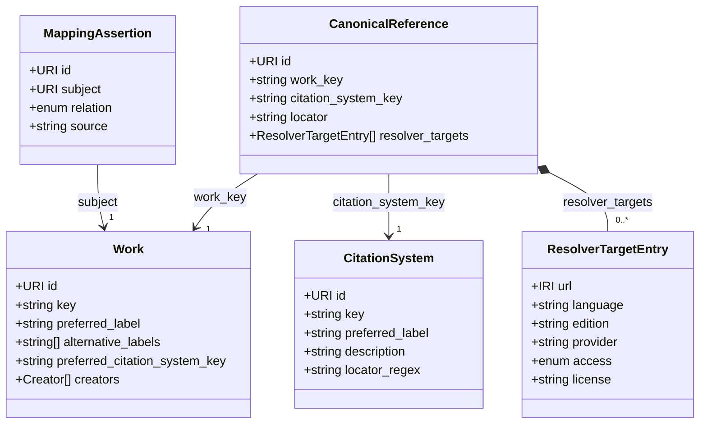

**Version:** 0.1.0-draft\
**Status:** Draft\
**Scope:** a minimal standard for machine-addressable canonical text references.

## 1. Purpose

TextRefs defines a minimal registry standard for stable, machine-addressable references to texts.

A conforming TextRefs registry MUST provide persistent identifiers for canonical references and MUST describe the citation systems by which those references are formed. It SHOULD record dereferenceable locations for those references and MAY record curated mappings to external identifiers or other references.

The standard is deliberately small. Its centre is a single idea: **a reference is an abstract identity, separate from any location, edition, or translation where the referenced text can be read.**

## 2. Conformance

A dataset conforms to the TextRefs Standard if it satisfies all of the following:

1. It represents registry data using the object types defined in this standard.
2. Every registry object includes the required fields for its object type.
3. Every `Work.key` and `CitationSystem.key` is a flat, stable key that occupies one URI path segment.
4. Every `CanonicalReference` points to one known `Work` and one known `CitationSystem`.
5. Every `CanonicalReference.locator` validates syntactically against the referenced `CitationSystem` and semantically by being a registered reference point for the referenced `Work`.
6. Every `CitationSystem` declares a `description` of its citation tradition and a `locator_regex` that is a valid ECMAScript regular expression.
7. Every dereferenceable location is represented as an entry in the `resolver_targets` array of its `CanonicalReference`, and every external identifier or cross-reference through a `MappingAssertion`.
8. Every registry object includes administrative metadata.
9. Registry records contain identifiers, metadata, mappings, provenance, and resolver targets rather than primary text content.

## 3. Normative language

The key words `MUST`, `MUST NOT`, `REQUIRED`, `SHALL`, `SHALL NOT`, `SHOULD`, `SHOULD NOT`, `RECOMMENDED`, `NOT RECOMMENDED`, `MAY`, and `OPTIONAL` in this document are to be interpreted as described in [BCP 14](https://www.rfc-editor.org/info/bcp14), [RFC 2119](https://www.rfc-editor.org/rfc/rfc2119), and [RFC 8174](https://www.rfc-editor.org/rfc/rfc8174) when, and only when, they appear in all capitals.

## 4. Identity versus location

TextRefs separates **identity** from **location**.

- **Identity** is abstract and language-independent. `Work`, `CitationSystem`, and `CanonicalReference` answer the question "_which_ passage": for example _the New Testament, book-chapter-verse, John.3.16_. There is exactly one such identity, regardless of how many editions, translations, or websites carry it.
- **Location and mapping** answer "_where_ can I read it" and "_what else_ relates to it". The `resolver_targets` array embedded in each `CanonicalReference` lists places where the reference can be read (specific translations, editions, or providers). `MappingAssertion` relates a `Work` to an external identifier or to another `Work` — either as another entity denoting the same work, or as a document about it ([§10](#10-mappingassertion)).

A reference such as `John.3.16` is the **same identity** whether read in Greek, the King James Version, or the Lutherbibel. The translation is a property of the _location_, never of the identity. This is what lets the model scale to works with many editions and translations (see [§13](#13-worked-example-a-multi-translation-work)).

TextRefs registry records store identifiers, metadata, mappings, provenance, and resolver targets. This keeps the registry legally reusable and stable across editions. A conforming record MUST NOT include full text, critical apparatus, commentary, translation text, or copyrighted edition content.

## 5. Core object types

A conforming registry MUST support these object types. Each top-level object MUST carry a `type` field matching one of them.

| Type                 | Layer               | Purpose                                                                 |
| -------------------- | ------------------- | ----------------------------------------------------------------------- |
| `Work`               | identity            | An abstract textual work.                                               |
| `CitationSystem`     | identity            | A notation that fragments works into locators.                          |
| `CanonicalReference` | identity + location | One abstract reference point in a work, with embedded resolver targets. |
| `MappingAssertion`   | relation            | A curated relation between a `Work` and an external identifier.         |

Dereferenceable locations are not a separate object type. They are recorded as entries in the `resolver_targets` array embedded in each `CanonicalReference` (see [§9](#9-embedded-resolver-targets)). This keeps language-tagged locations co-located with the reference they describe, and means a work with N translations adds N array entries — not N standalone records.

Every object additionally carries the shared administrative metadata of [§12](#12-administrative-metadata) (omitted from the diagram for clarity).



`MappingAssertion.subject` MUST be a `Work` IRI. Per-passage external identifiers (e.g. the CTS URN of a single verse) are derived from work-level mappings and the reference locator at resolve time, not stored as separate assertions (see [§10](#10-mappingassertion)).

## 6. Work

A `Work` represents an abstract textual work, independent of editions, translations, manuscripts, files, websites, or resolver targets.

Only canonical texts with an established reference system SHOULD be accepted as `Work` records. The existence of an author, title, edition, file, or web page is not by itself sufficient.

A `Work.key` is a single flat registry key used to identify the abstract work in references and deterministic UUID seeds. Choose a stable, human-readable key such as `plato.republic` or `new-testament`, and treat the whole string as the identifier. Rich bibliographic and authority data — catalogue records, edition histories, subject classifications — belongs in external systems and is connected to TextRefs records through `MappingAssertion`s. The one exception is minimal authorship: an optional `creators` array on `Work` carries enough structured data to render a usable citation without dereferencing an external authority.

```json
{
  "id": "https://textrefs.org/id/work/plato.republic",
  "key": "plato.republic",
  "type": "Work",
  "preferred_label": "Republic",
  "alternative_labels": ["Politeia", "Der Staat"],
  "preferred_citation_system_key": "stephanus",
  "creators": [{ "kind": "person", "family": "Plato" }],
  "status": "active",
  "created": "2026-05-31",
  "modified": "2026-05-31"
}
```

Required: `id`, `key`, `type` (`Work`), `preferred_label`, `preferred_citation_system_key`, `status`, plus administrative metadata ([§12](#12-administrative-metadata)). Optional: `alternative_labels`, `creators`, `alternateOf`, `isReferencedBy`. The `id` MUST be a persistent TextRefs HTTP URI of the form `https://textrefs.org/id/work/{key}`, where `{key}` is one flat key and occupies exactly one URI path segment. The `key` MUST be stable and suitable for deterministic identity generation.

- `preferred_citation_system_key` MUST reference a known `CitationSystem`. It governs the bare `/cite/{work_key}/{locator}/` alias and default presentation only; it is identity-neutral and MUST NOT affect the validation or resolution of a fully qualified reference ([§7](#7-citationsystem)).
- A `Work` MAY be referenced under more than one `CitationSystem`, of which exactly one is preferred.

`creators`, when present, is an array of entries discriminated by `kind`. A `person` entry has `family` (required) and `given` (optional); mononyms such as Plato or Homer use `family` alone, following CSL convention. A `literal` entry has `name` and is the escape hatch for pseudonymous, collective, or institutional authorship (e.g. `[Pseudo-]Aristotle`, an editorial committee). Anonymous works and canonical corpora such as the Bible simply omit `creators`. For attributed-but-disputed works, record the traditional attribution in `creators` and express uncertainty through mappings or editorial review notes, not in the name string. Implementations MUST treat the field as optional and MUST NOT infer authorship from `preferred_label` or `key`.

`alternative_labels`, when present, is an array of additional names for the work: abbreviations such as `NE`, translated titles such as `Nikomachische Ethik`, and other established short forms. It is published as `skos:altLabel`. The field serves search and display only. It is identity-neutral: no label is an input to any deterministic UUID seed ([§11](#11-identifier-policy)), so adding, editing, or removing an alternative label MUST NOT move an identifier. Each entry MUST be unique within the work and MUST NOT repeat the `preferred_label`. A work with no additional names MUST omit the field rather than publish an empty array. Two different works MAY claim the same alternative label — `Ethics` fits both Aristotle and Spinoza — and implementations MUST treat such a match as ambiguous rather than as an error. Implementations MUST NOT derive identity, authorship, or a citation system from an alternative label.

External identifiers for a `Work` (e.g. Wikidata Q-ID, DOI, VIAF) are asserted as `MappingAssertion`s whose `subject` is the `Work` ([§10](#10-mappingassertion)). They MUST NOT be authored directly on the `Work`.

`alternateOf` and `isReferencedBy` are the compiler's read-only projection of those assertions — every one whose `status` is not `deprecated`, `withdrawn` or `blocked`, grouped by `relation` — published straight from the work IRI as `prov:alternateOf` / `dcterms:isReferencedBy` edges ([JSON-LD](/standard/json-ld/#mapping-relations)). They carry no status or provenance; the `MappingAssertion` stays authoritative. The arrays enrich the work. They make no claim about review: a consumer that needs the status of a mapping MUST read the `MappingAssertion`.

## 7. CitationSystem

A `CitationSystem` defines the notation and validation rules used to identify locations within one or more works. It is independent of any edition, provider, resolver service, or software implementation. Different versification or pagination traditions are different citation systems.

A `CitationSystem.key` is a single flat registry key for a locator notation and its validation rules. Choose a stable, human-readable key such as `bekker`, `stephanus`, or `bible-book-chapter-verse`. The key is used by canonical references through `citation_system_key`, so changing the key changes identity.

```json
{
  "id": "https://textrefs.org/id/system/bible-book-chapter-verse",
  "key": "bible-book-chapter-verse",
  "type": "CitationSystem",
  "preferred_label": "Bible book-chapter-verse (OSIS)",
  "description": "OSIS locator: `Book.Chapter.Verse`. The canonical book vocabulary is the OSIS book abbreviation list (CrossWire), case-sensitive as published there — e.g. `Gen`, `Exod`, `Matt`, `John`, `1Cor`. Chapter and verse are positive integers without leading zeros. Both the Hebrew Bible and the New Testament cite with this grammar.",
  "locator_regex": "^(?<book>[1-4]?[A-Za-z][A-Za-z0-9]*)\\.(?<chapter>[1-9][0-9]*)\\.(?<verse>[1-9][0-9]*)$",
  "status": "active",
  "created": "2026-05-31",
  "modified": "2026-05-31"
}
```

Required: `id`, `key`, `type` (`CitationSystem`), `preferred_label`, `description`, `locator_regex`, plus administrative metadata. The `id` MUST be a persistent TextRefs HTTP URI of the form `https://textrefs.org/id/system/{key}`, where `{key}` is one flat key and occupies exactly one URI path segment.

- `description` documents the citation tradition and its canonical locator form in prose, including any canonical-form rules that cannot be expressed in `locator_regex`.
- `locator_regex` MUST be a valid ECMAScript regular expression.
- `locator_regex` provides machine-checkable pre-validation for locator shape only; it need not fully describe citation systems whose valid references cannot be expressed completely as a regular language.
- Citation systems SHOULD use an anchored `locator_regex` when the pattern is intended to describe the full locator string.
- Regex success does not by itself prove that a reference point exists in a work.
- Unicode handling for keys and locators MUST follow [Identifier syntax](/standard/identifier-syntax/#unicode-normalization).
- A pull request that adds or changes a citation system MUST include the full profile record. See [Citation-system profiles](/standard/system-profiles/).
- A `Work` MAY be cited under more than one `CitationSystem`, and the same locator string MAY denote different passages under different systems — which is why `citation_system_key` is part of `CanonicalReference` identity ([§11](#11-identifier-policy)).
- A `CanonicalReference` links to its citation system through `citation_system_key`. JSON-LD serializations MAY additionally expose that relation with `skos:inScheme`.

## 8. CanonicalReference

A `CanonicalReference` represents one atomized, **language-independent** reference point, identified by combining a work, a citation system, and a canonical locator. It also carries the set of dereferenceable external locations for that reference as an embedded `resolver_targets` array (see [§9](#9-embedded-resolver-targets)).

```json
{
  "id": "https://textrefs.org/id/ref/{uuid}",
  "type": "CanonicalReference",
  "work_key": "new-testament",
  "citation_system_key": "bible-book-chapter-verse",
  "locator": "John.3.16",
  "resolver_targets": [
    {
      "url": "https://www.stepbible.org/?q=version=SBLG|reference=John.3.16",
      "language": "grc",
      "edition": "SBL Greek New Testament",
      "provider": "STEP Bible",
      "access": "open",
      "license": "https://spdx.org/licenses/CC-BY-4.0"
    }
  ],
  "status": "active",
  "created": "2026-05-31",
  "modified": "2026-05-31"
}
```

Required: `id`, `type` (`CanonicalReference`), `work_key`, `citation_system_key`, `locator`, `resolver_targets` (MAY be empty), plus administrative metadata.

- `work_key` MUST reference a known `Work`; `citation_system_key` MUST reference a known `CitationSystem`.
- `work_key` and `citation_system_key` MUST be treated as opaque flat keys. Implementations MUST NOT infer author, corpus, title, hierarchy, or resolver behaviour by splitting either key.
- `locator` MUST be the canonical spelling defined by the citation-system profile and MUST match the system's `locator_regex`; additional profile-specific validation MAY be required for systems that are not fully regex-checkable. Non-canonical spellings MUST be rejected at validation time, never silently normalized (see [Identifier syntax](/standard/identifier-syntax/#unicode-normalization)).
- An accepted `CanonicalReference` MUST represent an attested reference point for the referenced `Work` under the referenced `CitationSystem`.
- A profile change that would alter the canonical spelling of any accepted locator changes reference identity and MUST be handled as a registry migration, a breaking registry release, or a new `citation_system_key` (see [Identifier syntax](/standard/identifier-syntax/#unicode-normalization)).
- The `id` MUST be generated deterministically per [Identifier syntax](/standard/identifier-syntax/); its UUID component is the deterministic seed output.
- `resolver_targets` MUST validate per [§9](#9-embedded-resolver-targets).

## 9. Embedded resolver targets

`resolver_targets` is the array on each `CanonicalReference` that records dereferenceable external locations where the reference can be read — typically specific **translations, editions, or providers**. Each entry is a plain object; it has no independent `id` or `type` of its own, because its identity is the parent reference plus its position in the array.

```json
{
  "url": "https://www.biblegateway.com/passage/?search=John%203%3A16&version=KJV",
  "language": "en",
  "edition": "King James Version",
  "provider": "Bible Gateway",
  "access": "open",
  "license": "https://spdx.org/licenses/CC0-1.0",
  "license_url": null,
  "last_checked": "2026-01-01"
}
```

Required per entry: `url`, `access`.

- `url` MUST be a dereferenceable external IRI ([RFC 3987](https://www.rfc-editor.org/rfc/rfc3987)).
- `language` MUST be present when the entry is language-specific (e.g. a translation), as a [BCP 47](https://www.rfc-editor.org/info/bcp47) language tag ([RFC 5646](https://www.rfc-editor.org/rfc/rfc5646)). Tags MUST include an [ISO 15924](https://www.unicode.org/iso15924/) script subtag when the entry uses a non-default script for the language (e.g. `grc-Grek`, `hbo-Hebr`, `grc-Latn`). `edition` SHOULD name the specific edition or version when known.
- `access` MUST be one of `open`, `paywalled`, `restricted`, `unknown`.
- `license`, when present, MUST be the canonical SPDX IRI (`https://spdx.org/licenses/{id}`) of a current or deprecated [SPDX license identifier](https://spdx.org/licenses/), so `dcterms:license` has a single IRI-typed range. Authoring formats carry the bare identifier (e.g. `CC0-1.0`, `CC-BY-4.0`) and the published record carries the IRI; see [§14](#14-validation-requirements) item 10.
- `license_url` is OPTIONAL and names the provider's rights statement: the page that sets out the terms under which the target may be used, such as a licensing page, a terms page, or an imprint. It is published as an IRI-typed `dcterms:rights`, which DCMI recommends be referred to by URI. It is not a second `license`, and a target MAY carry both: a target under a known SPDX licence can still point at the page that states it.
- Values implying permission to host copyrighted full text (e.g. a `license` of `proprietary` accompanied by hosted text) are forbidden; the no-text rule in [§2](#2-conformance) governs.
- A `CanonicalReference` whose `resolver_targets` is an empty array remains a valid identity record; adding or removing an entry MUST NOT change the parent reference's `id`.
- Tombstoning a single bad URL is done by removing the entry; tombstoning the whole reference uses the parent `status` field. There is no independent status on individual entries.

## 10. MappingAssertion

A `MappingAssertion` records a curated relation between a TextRefs `Work` and an **external identifier** (CTS URN, Wikidata Q-ID, DOI, ARK, …) or another TextRefs `Work`. There is no separate object type for external identifiers; they are always expressed as mapping targets.

```json
{
  "id": "https://textrefs.org/id/mapping/{uuid}",
  "type": "MappingAssertion",
  "subject": "https://textrefs.org/id/work/new-testament",
  "relation": "alternateOf",
  "target": {
    "identifier": "https://www.wikidata.org/entity/Q18813",
    "conforms_to": "https://www.wikidata.org/"
  },
  "source": "manual-curation",
  "status": "active",
  "created": "2026-05-31",
  "modified": "2026-05-31"
}
```

Required: `id`, `type` (`MappingAssertion`), `subject`, `relation`, `target`, `source`, plus administrative metadata.

- `subject` MUST be a `Work` IRI of the form `https://textrefs.org/id/work/{work_key}`. Per-passage external identifiers (e.g. the CTS URN of a single verse) are derived from work-level mappings combined with the reference locator at resolve time; they MUST NOT be stored as separate `MappingAssertion` records.
- `target.identifier` MUST be an IRI ([RFC 3987](https://www.rfc-editor.org/rfc/rfc3987)) that identifies a **textual resource**: a work, edition, manuscript, citation system, or another TextRefs `Work`.
- `target.conforms_to` is OPTIONAL. When present, it MUST be a dereferenceable IRI — or an array of such IRIs — identifying the specification or identifier scheme to which `target.identifier` conforms (e.g. the home page of the CTS specification, the Wikidata project, or a DOI handbook section). It is informative: validators MUST NOT key behaviour off it; the IRI in `identifier` is authoritative. See [Appendix B](#appendix-b-well-known-external-identifier-schemes-informative) for non-normative examples.
- `relation` MUST be chosen by what `target.identifier` denotes, never by author confidence: use `alternateOf` when the target is another entity denoting the same work (e.g. a Wikidata item); use `isReferencedBy` when the target is a document or page about the work (e.g. a Wikipedia article).
- The compiler registers every `target.identifier` in the presentational alias map, whatever the `relation` is. An `isReferencedBy` target stays a lookup key for its subject work, even though it denotes a document _about_ the work rather than the work itself. The alias map is a lookup convenience, not an identity claim: a consumer MUST NOT read an alias as an assertion that the two identifiers denote the same thing. See [Aliases vs. tombstones](/standard/versioning/#aliases-vs-tombstones).
- `source` documents the basis for the assertion. A structured [W3C PROV-O](https://www.w3.org/TR/prov-o/) mapping is reserved for a future version.

## 11. Identifier policy

TextRefs identifiers MUST be persistent HTTP URIs ([RFC 3986](https://www.rfc-editor.org/rfc/rfc3986)) or IRIs ([RFC 3987](https://www.rfc-editor.org/rfc/rfc3987)), independent of external URLs, resolver targets, edition identifiers, provider-specific identifiers, and website structures. The deterministic UUID seed remains ASCII-only; see [Identifier syntax](/standard/identifier-syntax/).

`Work` identifiers MUST use `https://textrefs.org/id/work/{key}` and `CitationSystem` identifiers MUST use `https://textrefs.org/id/system/{key}`. In both cases `{key}` is the complete flat key and MUST NOT contain additional path segments. For example, `https://textrefs.org/id/work/plato.republic` is valid; `https://textrefs.org/id/work/plato/republic` is not.

A `CanonicalReference` identifier MUST be generated deterministically. The identity seed MUST include `work_key`, `citation_system_key`, and `locator`, in that order (see [Identifier syntax](/standard/identifier-syntax/)).

A `MappingAssertion` identifier MUST be generated deterministically from `subject`, `relation`, and `target.identifier`, in that order, using the `mapping` namespace (see [Identifier syntax](/standard/identifier-syntax/#mappingassertion-seed)). It MUST remain UUID-based and MUST NOT be derived from provider URLs, corpus paths, or resolver structures. Resolver-target entries do not have their own identifiers.

The persistence promise attaches at **promotion**: the first time a record is published at status `active` ([§12](#12-administrative-metadata)). Promotion changes `status` only and MUST NOT change identity-defining fields, so the identifier survives promotion unchanged. Records at status `draft` are excluded from the persistence policy: they MAY be corrected (changing an identity field mints a different identifier; the previous one ceases to resolve) or retracted (the record is deleted) without a tombstone.

An implementation MUST NOT silently change the identity-defining fields of an existing **promoted** `CanonicalReference`. Because those fields seed the deterministic identifier, any change produces a new `CanonicalReference` with a new identifier. The prior reference MUST be retained as a tombstone (`status` `deprecated`, `withdrawn`, or `blocked`, [§12](#12-administrative-metadata)) and SHOULD carry the successor IRI in `superseded_by`. `MappingAssertion`s MUST NOT be used for succession; they are reserved for work-level relations to external identifiers ([§10](#10-mappingassertion)). The three tombstone statuses differ in reach. All three leave the `Work` mapping projections ([§6](#6-work)). A `deprecated` record is otherwise retained and still resolves. A `withdrawn` or `blocked` record additionally MUST NOT be depended on by a live record.

A conforming registry SHOULD publish each `/id/{type}/{key}` IRI at two static URLs: the canonical URL itself (HTML for browsers) and a sibling with a `.json` extension carrying the JSON-LD payload. The HTML representation SHOULD advertise the JSON-LD sibling via `<link rel="alternate" type="application/ld+json" href="…json">` in the document head. `Accept`-header content negotiation is not required.

## 12. Administrative metadata

Every registry object MUST include:

```json
{
  "status": "active",
  "created": "2026-01-01",
  "modified": "2026-01-01"
}
```

- `created` and `modified` MUST be [ISO 8601](https://www.iso.org/iso-8601-date-and-time-format.html) calendar dates in `YYYY-MM-DD` form.
- `status` MUST be one of:
  - `draft` — work-in-progress record under review; **excluded from the identifier persistence policy** ([§11](#11-identifier-policy)). May be corrected or retracted without a tombstone.
  - `active` — accepted, recommended for use, and permanently identified. Promotion from `draft` attaches the persistence promise.
  - `deprecated` — retained but no longer recommended.
  - `withdrawn` — removed from active use because it was erroneous or has been superseded.
  - `blocked` — retained as a visible tombstone because of a rights, trust, or policy dispute.

An incorrect `active` record is never deleted and its identity-defining fields are never mutated: it MUST instead be moved to `deprecated`, `withdrawn`, or `blocked`, with `superseded_by` set to the successor's IRI when a successor exists. Because identity is deterministic, the corrected tuple mints a new UUID at a new IRI; the original IRI keeps resolving as a tombstone.

Deprecated, withdrawn, and blocked records SHOULD remain visible unless removal is required for legal, privacy, or safety reasons.

`superseded_by` is OPTIONAL: the IRI of the record that replaces this one, published as `dcterms:isReplacedBy`. It MUST NOT appear unless `status` is `deprecated`, `withdrawn`, or `blocked` — a record still in use has no successor. Consumers follow it to reach the successor ([Versioning](/standard/versioning/#tombstones-and-re-minted-records)).

## 13. Worked example: a multi-translation work

This is the case that motivates separating identity from location. The New Testament exists in many editions and translations, yet `John.3.16` is **one** reference in the OSIS book-chapter-verse system.

**One identity** — a single `Work`, `CitationSystem`, and `CanonicalReference`. The reference embeds all language-tagged locations as `resolver_targets`:

```json
{
  "@context": "https://textrefs.org/contexts/v1.jsonld",
  "@graph": [
    {
      "id": "https://textrefs.org/id/work/new-testament",
      "key": "new-testament",
      "type": "Work",
      "preferred_label": "New Testament",
      "preferred_citation_system_key": "bible-book-chapter-verse",
      "status": "active",
      "created": "2026-05-31",
      "modified": "2026-05-31"
    },
    {
      "id": "https://textrefs.org/id/system/bible-book-chapter-verse",
      "key": "bible-book-chapter-verse",
      "type": "CitationSystem",
      "preferred_label": "Bible book-chapter-verse (OSIS)",
      "description": "OSIS locator: `Book.Chapter.Verse`. The canonical book vocabulary is the OSIS book abbreviation list (CrossWire), case-sensitive as published there — e.g. `Gen`, `Exod`, `Matt`, `John`, `1Cor`. Chapter and verse are positive integers without leading zeros. Both the Hebrew Bible and the New Testament cite with this grammar.",
      "locator_regex": "^(?<book>[1-4]?[A-Za-z][A-Za-z0-9]*)\\.(?<chapter>[1-9][0-9]*)\\.(?<verse>[1-9][0-9]*)$",
      "status": "active",
      "created": "2026-05-31",
      "modified": "2026-05-31"
    },
    {
      "id": "https://textrefs.org/id/ref/b6438d55-f3f2-5fc7-ab40-4f582f8774c3",
      "type": "CanonicalReference",
      "work_key": "new-testament",
      "citation_system_key": "bible-book-chapter-verse",
      "locator": "John.3.16",
      "resolver_targets": [
        {
          "url": "https://www.stepbible.org/?q=version=SBLG|reference=John.3.16",
          "language": "grc-Grek",
          "edition": "SBL Greek New Testament",
          "provider": "STEP Bible",
          "access": "open",
          "license": "https://spdx.org/licenses/CC-BY-4.0"
        },
        {
          "url": "https://www.biblegateway.com/passage/?search=John%203%3A16&version=KJV",
          "language": "en",
          "edition": "King James Version",
          "provider": "Bible Gateway",
          "access": "open",
          "license": "https://spdx.org/licenses/CC0-1.0"
        }
      ],
      "status": "active",
      "created": "2026-05-31",
      "modified": "2026-05-31"
    }
  ]
}
```

Adding another edition or translation appends one entry to `resolver_targets`. The reference identity — its UUID, its work, its citation system, its locator — does not change.

**Divergent versification** is the one case that _does_ create separate references. Where traditions number verses differently (e.g. the Psalms in the Masoretic text versus the Vulgate/Septuagint), each tradition is a distinct `CitationSystem`, its references are distinct `CanonicalReference`s — not collapsed into one identity. The equivalence between citation systems is not yet expressible in this version: `MappingAssertion.subject` MUST be a `Work` IRI ([§10](#10-mappingassertion)), so a system-to-system assertion cannot be authored. A future revision may widen `subject` to admit a `CitationSystem` IRI.

## 14. Validation requirements

A conforming validator MUST check:

1. required fields for each object type and for each `resolver_targets` entry;
2. object `type` values and TextRefs URI patterns, including `Work` and `CitationSystem` IDs whose keys occupy exactly one path segment;
3. flat-key syntax and uniqueness for `Work.key` and `CitationSystem.key`;
4. administrative metadata and `status` values;
5. citation-system `locator_regex` syntax;
6. canonical-reference locator syntax: the locator MUST be the profile's canonical spelling and match `locator_regex`; non-canonical spellings MUST be rejected, not normalized;
7. canonical-reference semantic validity: accepted records must be registered, attested reference points for their `Work` and `CitationSystem`;
8. deterministic-identifier correctness for canonical references and mapping assertions;
9. UUID-based identifier shape for `CanonicalReference` and `MappingAssertion` records;
10. `resolver_targets` entries: `access` values, BCP 47 syntax of `language`, and SPDX license IRI syntax of `license` when present ([§9](#9-embedded-resolver-targets)) — the bare SPDX identifier form is an authoring-time check, not a published-record validation concern;
11. mapping `relation` values and the Work-IRI shape of `MappingAssertion.subject`;
12. absence of forbidden full-text/apparatus/commentary content;
13. that no `active` record depends on a `draft` one: an `active` `CanonicalReference` references an `active` `Work` and an `active` `CitationSystem`, and an `active` `MappingAssertion` takes an `active` `Work` as its `subject`; `Work.preferred_citation_system_key` MUST reference a known `CitationSystem`, and an `active` `Work` requires an `active` preferred `CitationSystem`.

A validator SHOULD report errors in a machine-readable format, and SHOULD distinguish syntactically valid, registered, mapped, and resolvable references. An input locator that matches `locator_regex` but has no corresponding registered `CanonicalReference` is syntactically valid but not a valid TextRefs reference.

A normative [JSON Schema 2020-12](https://json-schema.org/specification-links#2020-12) document, generated from the canonical Zod schemas, is published at `https://textrefs.org/schemas/v1/textrefs.schema.json`. The Zod schemas are the implementation source of truth; the JSON Schema is the published machine-readable contract.

## 15. Extensions

Implementations MAY define extensions, but extensions MUST NOT change the meaning of standard fields and MUST NOT make non-standard fields required for conformance. Content-related extensions MUST be defined separately from this standard.

## 16. Normative references

This standard relies on the following external standards. Each is normative wherever it is cited above.

| Topic                                | Standard                                                                                             |
| ------------------------------------ | ---------------------------------------------------------------------------------------------------- |
| Normative keywords                   | [BCP 14](https://www.rfc-editor.org/info/bcp14) / RFC 2119 / RFC 8174                                |
| Language tags                        | [BCP 47](https://www.rfc-editor.org/info/bcp47) / [RFC 5646](https://www.rfc-editor.org/rfc/rfc5646) |
| Script subtags                       | [ISO 15924](https://www.unicode.org/iso15924/)                                                       |
| Dates                                | [ISO 8601](https://www.iso.org/iso-8601-date-and-time-format.html)                                   |
| URIs                                 | [RFC 3986](https://www.rfc-editor.org/rfc/rfc3986)                                                   |
| IRIs                                 | [RFC 3987](https://www.rfc-editor.org/rfc/rfc3987)                                                   |
| UUIDs                                | [RFC 9562](https://www.rfc-editor.org/rfc/rfc9562)                                                   |
| Unicode normalization (NFC)          | [Unicode Standard Annex #15](https://www.unicode.org/reports/tr15/)                                  |
| Regular expression dialect           | [ECMA-262](https://262.ecma-international.org/) §22.2                                                |
| Versioning                           | [SemVer 2.0.0](https://semver.org/spec/v2.0.0.html)                                                  |
| Linked-data serialization            | [JSON-LD 1.1](https://www.w3.org/TR/json-ld11/)                                                      |
| Labels and concept schemes           | [SKOS](https://www.w3.org/TR/skos-reference/)                                                        |
| Alternate-presentation relations     | [PROV-O](https://www.w3.org/TR/prov-o/)                                                              |
| Dates, provenance, language, licence | [Dublin Core Terms](https://www.dublincore.org/specifications/dublin-core/dcmi-terms/)               |
| URL, provider, edition, work type    | [schema.org](https://schema.org/)                                                                    |
| Licence identifiers                  | [SPDX License List](https://spdx.org/licenses/)                                                      |
| Machine-readable schema              | [JSON Schema 2020-12](https://json-schema.org/specification-links#2020-12)                           |

## Appendix A. Conformance boundary

This standard defines the minimum requirements for a TextRefs registry. Applications, resolvers, editorial tools, APIs, and visualizations may be built on top of it; they conform only insofar as their registry records satisfy this standard.

Build on the core registry by keeping these concerns in application, extension, or resolver layers:

- full-text hosting, edition/manuscript modelling, translation hosting, textual apparatus, commentary, thematic annotation;
- authority-file or catalogue modelling for agents, organisations, subjects, genres, or corpora;
- citation-style rendering, recommendation systems, legal rights clearance for external content.

## Appendix B. Well-known external identifier schemes (informative)

The following identifier schemes commonly satisfy [§10](#10-mappingassertion)'s "textual resource" rule and are useful values for `MappingAssertion.target.identifier`. Treat this table as implementation guidance: the authoritative rule is still whether the IRI identifies a textual resource. The `conforms_to` column gives a representative scheme IRI; any dereferenceable IRI that identifies the same specification is equally valid.

| Scheme   | Example identifier                                | Example `conforms_to`                                         |
| -------- | ------------------------------------------------- | ------------------------------------------------------------- |
| TextRefs | `https://textrefs.org/id/ref/988e0b39-…`          | `https://textrefs.org/`                                       |
| CTS URN  | `urn:cts:greekLit:tlg0031.tlg004:3.16`            | `https://cite-architecture.github.io/`                        |
| DTS      | `https://dts.example/api/collection?id=urn:cts:…` | `https://distributed-text-services.github.io/specifications/` |
| DOI      | `https://doi.org/10.5281/zenodo.7702622`          | `https://www.doi.org/`                                        |
| ARK      | `https://n2t.net/ark:/12148/btv1b8451636f`        | `https://arks.org/`                                           |
| Handle   | `https://hdl.handle.net/1887/4531`                | `https://www.handle.net/`                                     |
| PURL     | `https://purl.org/dc/terms/`                      | `https://purl.archive.org/`                                   |
| URN:NBN  | `urn:nbn:de:bvb:12-bsb00012345-2`                 | `https://nbn-resolving.org/`                                  |
| Wikidata | `https://www.wikidata.org/entity/Q42`             | `https://www.wikidata.org/`                                   |

TextRefs keeps mappings focused on textual resources. Identifiers of agents, organisations, instruments, or non-textual datasets (e.g. ROR, ORCID, ISNI) belong in external authority systems reached through mapped textual resources, not in `MappingAssertion.target`.

A passage-level external identifier (e.g. the CTS URN of a single verse) is **derived** at resolve time from the work-level mapping plus the reference locator; it is not stored as a separate `MappingAssertion`. For example, a `Work` mapping `new-testament → urn:cts:greekLit:tlg0031.tlg004` plus the reference locator `John.3.16` can yield a derived passage URN for that verse. Source data carries the work-level mapping plus a locator template; the registry does not store one mapping per passage.
