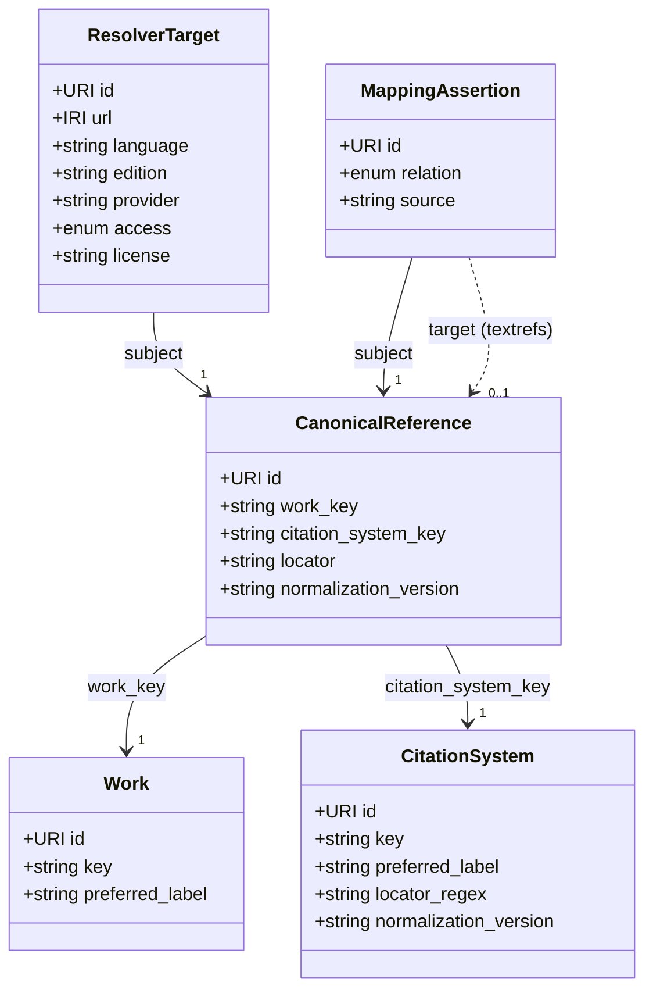

:::caution[Working draft]
TextRefs `v0.1.0-draft` is an **unstable working draft**. The data model and this specification may change without notice and without a version bump while the core is being settled. Do not rely on it for production use yet.
:::

**Version:** 0.1.0-draft\
**Status:** Draft\
**Scope:** a minimal standard for machine-addressable canonical text references.

## 1. Purpose

TextRefs defines a minimal registry standard for stable, machine-addressable references to texts.

A conforming TextRefs registry MUST provide persistent identifiers for canonical references and MUST describe the citation systems by which those references are formed. It MAY record dereferenceable locations for those references and curated mappings to external identifiers or other references.

The standard is deliberately small. Its centre is a single idea: **a reference is an abstract identity, separate from any location, edition, or translation where the referenced text can be read.**

## 2. Conformance

A dataset conforms to the TextRefs Standard if it satisfies all of the following:

1. It represents registry data using the object types defined in this standard.
2. Every registry object includes the required fields for its object type.
3. Every `CanonicalReference` points to one known `Work` and one known `CitationSystem`.
4. Every `CanonicalReference.locator` validates syntactically against the referenced `CitationSystem` and semantically by being a registered reference point for the referenced `Work`.
5. Every `CitationSystem` declares valid and invalid examples for automated tests.
6. Every dereferenceable location is represented through a `ResolverTarget`, and every external identifier or cross-reference equivalence through a `MappingAssertion`.
7. Every registry object includes administrative metadata.
8. Registry records contain identifiers, metadata, mappings, provenance, and resolver targets rather than primary text content.

## 3. Normative language

The key words `MUST`, `MUST NOT`, `REQUIRED`, `SHALL`, `SHALL NOT`, `SHOULD`, `SHOULD NOT`, `RECOMMENDED`, `NOT RECOMMENDED`, `MAY`, and `OPTIONAL` in this document are to be interpreted as described in [BCP 14](https://www.rfc-editor.org/info/bcp14), [RFC 2119](https://www.rfc-editor.org/rfc/rfc2119), and [RFC 8174](https://www.rfc-editor.org/rfc/rfc8174) when, and only when, they appear in all capitals.

## 4. Identity versus location

TextRefs separates **identity** from **location**.

- **Identity** is abstract and language-independent. `Work`, `CitationSystem`, and `CanonicalReference` answer the question "_which_ passage": for example _the Gospel of John, chapter-and-verse, 3:16_. There is exactly one such identity, regardless of how many editions, translations, or websites carry it.
- **Location and equivalence** answer "_where_ can I read it" and "_what else_ is this the same as". `ResolverTarget` records a place where a reference can be read (a specific translation, edition, or provider); `MappingAssertion` records that a reference is equivalent to an external identifier or to another reference.

A reference such as `John 3:16` is the **same identity** whether read in Greek, the King James Version, or the Lutherbibel. The translation is a property of the _location_, never of the identity. This is what lets the model scale to works with hundreds of translations (see [§13](#13-worked-example-a-multi-translation-work)).

TextRefs registry records store identifiers, metadata, mappings, provenance, and resolver targets. This keeps the registry legally reusable and stable across editions. A conforming record MUST NOT include full text, critical apparatus, commentary, translation text, or copyrighted edition content.

## 5. Core object types

A conforming registry MUST support these object types. Each object MUST carry a `type` field matching one of them.

| Type                 | Layer       | Purpose                                                       |
| -------------------- | ----------- | ------------------------------------------------------------- |
| `Work`               | identity    | An abstract textual work.                                     |
| `CitationSystem`     | identity    | A notation that fragments works into locators.                |
| `CanonicalReference` | identity    | One abstract reference point in a work.                       |
| `ResolverTarget`     | location    | A place where a reference can be read.                        |
| `MappingAssertion`   | equivalence | A curated equivalence to an external ID or another reference. |

The five types depend on one another as follows. Every object additionally carries the shared administrative metadata of [§12](#12-administrative-metadata) (omitted from the diagram for clarity).



A `MappingAssertion.target` may instead be an external identifier (CTS URN, Wikidata Q-ID, DOI, ARK, …); there is no separate object type for external identifiers, so that case is expressed inline in the assertion rather than as a node above (see [§10](#10-mappingassertion) and [Appendix B](#appendix-b-well-known-external-identifier-schemes-informative)).

## 6. Work

A `Work` represents an abstract textual work, independent of editions, translations, manuscripts, files, websites, or resolver targets.

```json
{
  "id": "https://textrefs.org/id/work/bible/john",
  "key": "bible:john",
  "type": "Work",
  "preferred_label": "Gospel of John",
  "status": "active",
  "created": "2026-01-01",
  "modified": "2026-01-01"
}
```

Required: `id`, `key`, `type` (`Work`), `preferred_label`, `status`, plus administrative metadata ([§12](#12-administrative-metadata)). The `id` MUST be a persistent TextRefs HTTP URI; the `key` MUST be stable and suitable for deterministic identity generation.

External identifiers for a `Work` (e.g. Wikidata Q-ID, DOI, VIAF) are recorded as `MappingAssertion`s whose `subject` is the `Work`. They are not fields on the `Work` itself.

## 7. CitationSystem

A `CitationSystem` defines the notation and validation rules used to identify locations within one or more works. It is independent of any edition, provider, resolver service, or software implementation. Different versification or pagination traditions are different citation systems.

```json
{
  "id": "https://textrefs.org/id/system/bible-chapter-verse",
  "key": "bible-chapter-verse",
  "type": "CitationSystem",
  "preferred_label": "Bible chapter and verse",
  "scope": "Protestant chapter-and-verse versification",
  "normalization_version": "1.0.0",
  "locator_regex": "^[0-9]{1,3}:[0-9]{1,3}$",
  "examples": {
    "valid": ["3:16", "1:1"],
    "invalid": ["3", "3:", "iii:16"]
  },
  "status": "active",
  "created": "2026-01-01",
  "modified": "2026-01-01"
}
```

Required: `id`, `key`, `type` (`CitationSystem`), `preferred_label`, `normalization_version`, `locator_regex`, `examples.valid`, `examples.invalid`, plus administrative metadata.

- `scope` SHOULD describe the corpus or tradition the system applies to; it disambiguates divergent versification or pagination traditions.
- `locator_regex` MUST be an anchored ECMAScript regular expression.
- `locator_regex` validates locator shape only; it does not by itself prove that a reference point exists in a work.
- `normalization_version` MUST use semantic versioning.
- `examples.valid` MUST all match `locator_regex`; `examples.invalid` MUST all fail it.
- Unicode handling for keys and locators MUST follow [Identifier syntax](/standard/identifier-syntax/#unicode-normalization).
- A pull request that adds or changes a citation system MUST include the profile, valid examples, invalid examples, and a scope note. See [Citation-system profiles](/standard/system-profiles/).
- In the JSON-LD view, a `CitationSystem` is a `skos:ConceptScheme` and its `CanonicalReference`s are `skos:inScheme` it.

## 8. CanonicalReference

A `CanonicalReference` represents one atomized, **language-independent** reference point, identified by combining a work, a citation system, a normalized locator, and a normalization version.

```json
{
  "id": "https://textrefs.org/id/ref/{uuid}",
  "type": "CanonicalReference",
  "work_key": "bible:john",
  "citation_system_key": "bible-chapter-verse",
  "locator": "3:16",
  "normalization_version": "1.0.0",
  "status": "active",
  "created": "2026-01-01",
  "modified": "2026-01-01"
}
```

Required: `id`, `type` (`CanonicalReference`), `work_key`, `citation_system_key`, `locator`, `normalization_version`, plus administrative metadata.

- `work_key` MUST reference a known `Work`; `citation_system_key` MUST reference a known `CitationSystem`.
- `locator` MUST match the system's `locator_regex`.
- An accepted `CanonicalReference` MUST represent an attested reference point for the referenced `Work` under the referenced `CitationSystem`.
- `normalization_version` is part of the reference's identity and is fixed when the reference is minted; it records the normalization in force at that time and need not equal the citation system's current `normalization_version`. Its correctness is verified by the deterministic identifier (see [§14](#14-validation-requirements) and [Identifier syntax](/standard/identifier-syntax/)).
- The `id` MUST be generated deterministically per [Identifier syntax](/standard/identifier-syntax/); its UUID component is the deterministic seed output.

## 9. ResolverTarget

A `ResolverTarget` records a dereferenceable external location where a reference can be read — typically a specific **translation, edition, or provider**. A resolver target never defines TextRefs identity; it points outward from a reference.

```json
{
  "id": "https://textrefs.org/id/target/{uuid}",
  "type": "ResolverTarget",
  "subject": "https://textrefs.org/id/ref/{uuid}",
  "url": "https://www.biblegateway.com/passage/?search=John%203%3A16&version=KJV",
  "language": "en",
  "edition": "King James Version",
  "provider": "Bible Gateway",
  "access": "open",
  "license": "CC0-1.0",
  "license_url": null,
  "last_checked": "2026-01-01",
  "status": "active",
  "created": "2026-01-01",
  "modified": "2026-01-01"
}
```

Required: `id`, `type` (`ResolverTarget`), `subject`, `url`, `access`, plus administrative metadata.

- `subject` MUST point to a TextRefs object (usually a `CanonicalReference`).
- `url` MUST be a dereferenceable external IRI ([RFC 3987](https://www.rfc-editor.org/rfc/rfc3987)).
- `language` MUST be present when the target is language-specific (e.g. a translation), as a [BCP 47](https://www.rfc-editor.org/info/bcp47) language tag ([RFC 5646](https://www.rfc-editor.org/rfc/rfc5646)). Tags MUST include an [ISO 15924](https://www.unicode.org/iso15924/) script subtag when the target uses a non-default script for the language (e.g. `grc-Grek`, `hbo-Hebr`, `grc-Latn`). `edition` SHOULD name the specific edition or version when known.
- `access` MUST be one of `open`, `paywalled`, `restricted`, `unknown`.
- `license` SHOULD be a current [SPDX license identifier](https://spdx.org/licenses/) (e.g. `CC0-1.0`, `CC-BY-4.0`) when the licence of the target resource is known. For licences not in the SPDX list, omit `license` and use the optional `license_url` to point at the licence text.
- Values implying permission to host copyrighted full text (e.g. a `license` of `proprietary` accompanied by hosted text) are forbidden; the no-text rule in [§2](#2-conformance) governs.
- When a rights or trust dispute is accepted for review, the target SHOULD be set to status `blocked` and retained as a visible tombstone.

## 10. MappingAssertion

A `MappingAssertion` records a curated equivalence claim. It connects a TextRefs object either to an **external identifier** (CTS URN, Wikidata Q-ID, DOI, ARK, …) or to **another TextRefs reference** (for example, equating references across two divergent versification systems). There is no separate object type for external identifiers; they are always expressed as mapping targets. The subject MAY be any TextRefs object — most commonly a `CanonicalReference`, but also a `Work` (e.g. to map a `Work` to its Wikidata Q-ID) or a `CitationSystem`.

```json
{
  "id": "https://textrefs.org/id/mapping/{uuid}",
  "type": "MappingAssertion",
  "subject": "https://textrefs.org/id/ref/{uuid}",
  "relation": "closeMatch",
  "target": {
    "target_kind": "cts",
    "identifier": "urn:cts:greekLit:tlg0031.tlg004:3.16"
  },
  "source": "manual-curation",
  "status": "candidate",
  "created": "2026-01-01",
  "modified": "2026-01-01"
}
```

Required: `id`, `type` (`MappingAssertion`), `subject`, `relation`, `target`, `source`, plus administrative metadata.

- `subject` MUST point to a TextRefs object.
- `target.identifier` MUST be an IRI ([RFC 3987](https://www.rfc-editor.org/rfc/rfc3987)) that identifies a **textual resource**: a work, edition, manuscript, passage, citation system, citation point, or another TextRefs object. Use authority, organisation, instrument, or dataset identifiers (e.g. ROR, ORCID, ISNI) in descriptive metadata rather than `MappingAssertion.target`.
- `target.target_kind` is OPTIONAL and is a human-readable scheme hint (e.g. `"cts"`, `"doi"`, `"wikidata"`, `"textrefs"`). Validators MUST NOT key behaviour off it. The presence or absence of `target_kind` carries no normative weight; the IRI in `identifier` is authoritative. See [Appendix B](#appendix-b-well-known-external-identifier-schemes-informative) for non-normative examples.
- `relation` MUST be one of the SKOS-compatible values `exactMatch` or `closeMatch`. Use `exactMatch` only when the mapped object identifies the same reference with sufficient precision; if there is any uncertainty about segmentation, edition, translation, scope, or locator alignment, use `closeMatch`.
- `source` documents the basis for the assertion. A structured [W3C PROV-O](https://www.w3.org/TR/prov-o/) mapping is reserved for a future version.

## 11. Identifier policy

TextRefs identifiers MUST be persistent HTTP URIs ([RFC 3986](https://www.rfc-editor.org/rfc/rfc3986)) or IRIs ([RFC 3987](https://www.rfc-editor.org/rfc/rfc3987)), independent of external URLs, resolver targets, edition identifiers, provider-specific identifiers, and website structures. The deterministic UUID seed remains ASCII-only; see [Identifier syntax](/standard/identifier-syntax/).

A `CanonicalReference` identifier MUST be generated deterministically. The identity seed MUST include `work_key`, `citation_system_key`, `locator`, and `normalization_version`, in that order (see [Identifier syntax](/standard/identifier-syntax/)).

An implementation MUST NOT silently change the identity-defining fields of an existing `CanonicalReference`. Because those fields seed the deterministic identifier, any change produces a new `CanonicalReference` with a new identifier. The prior reference MUST be retained as a tombstone (`status` `deprecated` or `withdrawn`, [§12](#12-administrative-metadata)) and SHOULD be linked to its replacement through an `exactMatch` `MappingAssertion` ([§10](#10-mappingassertion)).

## 12. Administrative metadata

Every registry object MUST include:

```json
{
  "status": "active",
  "created": "2026-01-01",
  "modified": "2026-01-01"
}
```

- `created` and `modified` MUST be [ISO 8601](https://www.iso.org/iso-8601-date-and-time-format.html) calendar dates in `YYYY-MM-DD` form.
- `status` MUST be one of:
  - `candidate` — proposed but not yet accepted as stable.
  - `active` — accepted and recommended for use.
  - `deprecated` — retained but no longer recommended.
  - `withdrawn` — removed from active use because it was erroneous or superseded.
  - `blocked` — retained as a visible tombstone because of a rights, trust, or policy dispute.

Deprecated, withdrawn, and blocked records SHOULD remain visible unless removal is required for legal, privacy, or safety reasons.

## 13. Worked example: a multi-translation work

This is the case that motivates separating identity from location. The Bible exists in hundreds of translations, yet `John 3:16` is **one** reference.

**One identity** — a single `Work`, `CitationSystem`, and `CanonicalReference`:

```json
{
  "work": {
    "key": "bible:john",
    "type": "Work",
    "preferred_label": "Gospel of John"
  },
  "citation_system": {
    "key": "bible-chapter-verse",
    "type": "CitationSystem",
    "locator_regex": "^[0-9]{1,3}:[0-9]{1,3}$"
  },
  "canonical_reference": {
    "type": "CanonicalReference",
    "work_key": "bible:john",
    "citation_system_key": "bible-chapter-verse",
    "locator": "3:16"
  }
}
```

**Many locations** — one `ResolverTarget` per translation, all sharing the same `subject` reference. Adding a 101st language adds a 101st target, never a new reference:

```json
[
  {
    "type": "ResolverTarget",
    "subject": ".../ref/{john-3-16}",
    "language": "en",
    "edition": "King James Version",
    "provider": "Bible Gateway",
    "access": "open",
    "license": "CC0-1.0"
  },
  {
    "type": "ResolverTarget",
    "subject": ".../ref/{john-3-16}",
    "language": "de",
    "edition": "Lutherbibel 1984",
    "provider": "die-bibel.de",
    "access": "open"
  }
]
```

**Divergent versification** is the one case that _does_ create separate references. Where traditions number verses differently (e.g. the Psalms in the Masoretic text versus the Vulgate/Septuagint), each tradition is a distinct `CitationSystem`, its references are distinct `CanonicalReference`s, and the equivalence between them is recorded as a `closeMatch` `MappingAssertion` — not by collapsing them into one identity.

## 14. Validation requirements

A conforming validator MUST check:

1. required fields for each object type;
2. object `type` values and TextRefs URI patterns;
3. administrative metadata and `status` values;
4. citation-system `locator_regex` syntax, and its valid/invalid examples;
5. canonical-reference locator syntax (the `normalization_version` is the value fixed at minting, verified by the deterministic identifier in item 7, not matched against the system's current version);
6. canonical-reference semantic validity: accepted records must be registered, attested reference points for their `Work` and `CitationSystem`;
7. deterministic-identifier correctness for canonical references;
8. resolver-target `access` values, BCP 47 syntax of `language` and its presence for language-specific targets, and SPDX syntax of `license` when present;
9. mapping `relation` values;
10. absence of forbidden full-text/apparatus/commentary content.

A validator SHOULD report errors in a machine-readable format, and SHOULD distinguish syntactically valid, registered, mapped, and resolvable references. An input locator that matches `locator_regex` but has no corresponding registered `CanonicalReference` is syntactically valid but not a valid TextRefs reference.

A normative [JSON Schema 2020-12](https://json-schema.org/specification-links#2020-12) document, generated from the canonical Zod schemas, is published at `https://textrefs.org/schemas/v1/textrefs.schema.json`. The Zod schemas are the implementation source of truth; the JSON Schema is the published machine-readable contract.

## 15. Extensions

Implementations MAY define extensions, but extensions MUST NOT change the meaning of standard fields and MUST NOT make non-standard fields required for conformance. Content-related extensions MUST be defined separately from this standard.

## 16. Normative references

This standard relies on the following external standards. Each is normative wherever it is cited above.

| Topic                                | Standard                                                                                             |
| ------------------------------------ | ---------------------------------------------------------------------------------------------------- |
| Normative keywords                   | [BCP 14](https://www.rfc-editor.org/info/bcp14) / RFC 2119 / RFC 8174                                |
| Language tags                        | [BCP 47](https://www.rfc-editor.org/info/bcp47) / [RFC 5646](https://www.rfc-editor.org/rfc/rfc5646) |
| Script subtags                       | [ISO 15924](https://www.unicode.org/iso15924/)                                                       |
| Dates                                | [ISO 8601](https://www.iso.org/iso-8601-date-and-time-format.html)                                   |
| URIs                                 | [RFC 3986](https://www.rfc-editor.org/rfc/rfc3986)                                                   |
| IRIs                                 | [RFC 3987](https://www.rfc-editor.org/rfc/rfc3987)                                                   |
| UUIDs                                | [RFC 4122](https://www.rfc-editor.org/rfc/rfc4122)                                                   |
| Unicode normalization (NFC)          | [Unicode Standard Annex #15](https://www.unicode.org/reports/tr15/)                                  |
| Regular expression dialect           | [ECMA-262](https://262.ecma-international.org/) §22.2                                                |
| Versioning                           | [SemVer 2.0.0](https://semver.org/spec/v2.0.0.html)                                                  |
| Linked-data serialization            | [JSON-LD 1.1](https://www.w3.org/TR/json-ld11/)                                                      |
| Concepts and mapping relations       | [SKOS](https://www.w3.org/TR/skos-reference/)                                                        |
| Dates, provenance, language, licence | [Dublin Core Terms](https://www.dublincore.org/specifications/dublin-core/dcmi-terms/)               |
| URL, provider, edition, work type    | [schema.org](https://schema.org/)                                                                    |
| Licence identifiers                  | [SPDX License List](https://spdx.org/licenses/)                                                      |
| Machine-readable schema              | [JSON Schema 2020-12](https://json-schema.org/specification-links#2020-12)                           |

## Appendix A. Conformance boundary

This standard defines the minimum requirements for a TextRefs registry. Applications, resolvers, editorial tools, APIs, and visualizations may be built on top of it; they conform only insofar as their registry records satisfy this standard.

Build on the core registry by keeping these concerns in application, extension, or resolver layers:

- full-text hosting, edition/manuscript modelling, translation hosting, textual apparatus, commentary, thematic annotation;
- citation-style rendering, recommendation systems, legal rights clearance for external content.

## Appendix B. Well-known external identifier schemes (informative)

The following identifier schemes commonly satisfy [§10](#10-mappingassertion)'s "textual resource" rule and are useful values for `MappingAssertion.target.identifier`. Treat this table as implementation guidance: the authoritative rule is still whether the IRI identifies a textual resource.

| Scheme   | `target_kind` hint | Example identifier                                |
| -------- | ------------------ | ------------------------------------------------- |
| TextRefs | `textrefs`         | `https://textrefs.org/id/ref/988e0b39-…`          |
| CTS URN  | `cts`              | `urn:cts:greekLit:tlg0031.tlg004:3.16`            |
| DTS      | `dts`              | `https://dts.example/api/collection?id=urn:cts:…` |
| DOI      | `doi`              | `https://doi.org/10.1093/oseo/instance.00266836`  |
| ARK      | `ark`              | `https://n2t.net/ark:/12148/btv1b8451636f`        |
| Handle   | `handle`           | `https://hdl.handle.net/2027/uc1.b000123456`      |
| PURL     | `purl`             | `https://purl.org/dc/terms/`                      |
| URN:NBN  | `urn-nbn`          | `urn:nbn:de:bvb:12-bsb00012345-2`                 |
| Wikidata | `wikidata`         | `https://www.wikidata.org/entity/Q42`             |

Use identifiers of agents, organisations, instruments, or non-textual datasets (e.g. ROR, ORCID, ISNI) as descriptive metadata when needed. They MUST NOT appear in `MappingAssertion.target`, which is reserved for textual resources.
